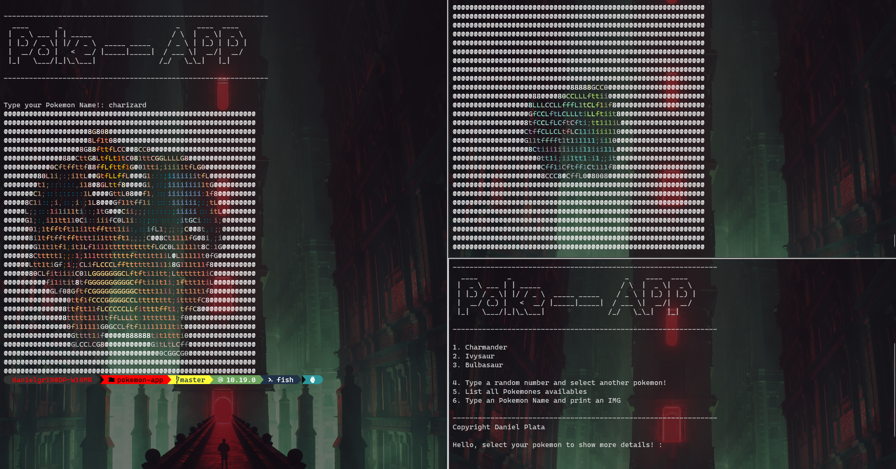

<h1>Pokemón Console APP - NodeJS</h1>

<b>Pokemón APP</b> - its an NodeJS App that runs in console, and returns you all list of the first generation pokemon availables, that you can display on your console with an image included.
 

This App its an personal app test that i used to learn Node package usability.

  
 

<h2>Dependencies</h2>

For the correct IMG display on your console, you need to install two dependencies that will allow your console to display ASCII Art Images that this app generates, this is required for both system's Windows 10 and Linux

<ul>
  <li><a href="http://www.graphicsmagick.org/INSTALL-windows.html">Graphics Magick</a></li>
  <li><a href="https://imagemagick.org/script/download.php">Image Magick</a></li>
</ul>
